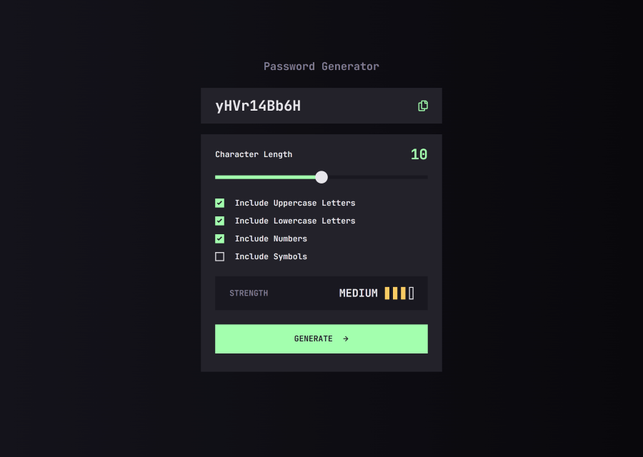

# Frontend Mentor - Password generator app solution

This is a solution to the [Password generator app challenge on Frontend Mentor](https://www.frontendmentor.io/challenges/password-generator-app-Mr8CLycqjh). Frontend Mentor challenges help you improve your coding skills by building realistic projects.

### The challenge

Users should be able to:

- Generate a password based on the selected inclusion options
- Copy the generated password to the computer's clipboard
- See a strength rating for their generated password
- View the optimal layout for the interface depending on their device's screen size
- See hover and focus states for all interactive elements on the page

### Screenshot



### Links

- Solution URL: [https://www.frontendmentor.io/solutions/password-generator-app-vite-sass-GbuxIQrlyc](https://www.frontendmentor.io/solutions/password-generator-app-vite-sass-GbuxIQrlyc)
- Live Site URL: [https://nuzaty.github.io/fm-13-password-generator/](https://nuzaty.github.io/fm-13-password-generator/)

### Built with

- Semantic HTML5 markup
- Flexbox
- CSS Grid
- Mobile-first workflow
- [Sass (Dart Sass)](https://sass-lang.com/)
- [BEM](https://getbem.com/)
- JS
- [Vite](https://vite.dev/)
- Component-based
- [zxcvbn](https://github.com/dropbox/zxcvbn)

### What I learned

About 4–5 years ago, I built web apps in different ways, but my work has mostly been backend-focused rather than frontend. When I did frontend, I usually relied on frameworks and build tools to speed things up and make collaboration easier. In this project, I tried removing the framework and used only Vite with plain JavaScript to see how it feels again.

Working directly with the DOM reminded me why I liked JSX and frameworks like React in the first place. Doing everything manually is possible, but it gets messy faster than I expected, and I can clearly see how frameworks help simplify many everyday frontend problems.

One takeaway for me: trying plain JavaScript again is useful for understanding fundamentals, but for larger or long-term projects, a framework still makes development more maintainable.

### Run Guide

**1. Install dependencies**

```bash
npm install
```

**2. Run development server**

Start local development (hot reload enabled):

```bash
npm run dev
```

### Build / Preview Guide

**Build for production**

Generate optimized production files:

```bash
npm run build
```

Output folder:

```
dist/
```

**Preview production build**

Run the built version locally:

```bash
npm run preview
```

This serves the `dist/` folder so you can test production behavior before deploying.

**Clean rebuild (if something breaks)**

```bash
rm -rf node_modules dist
npm install
npm run build
```

(Windows PowerShell)

```powershell
Remove-Item -Recurse -Force node_modules, dist
npm install
npm run build
```
